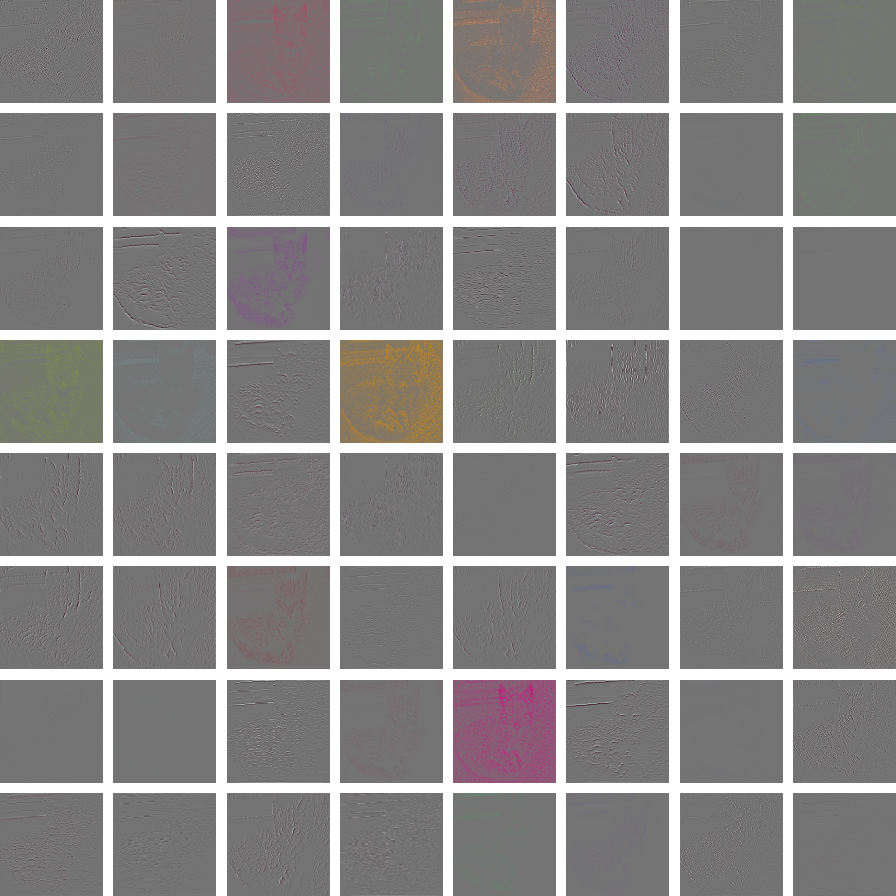
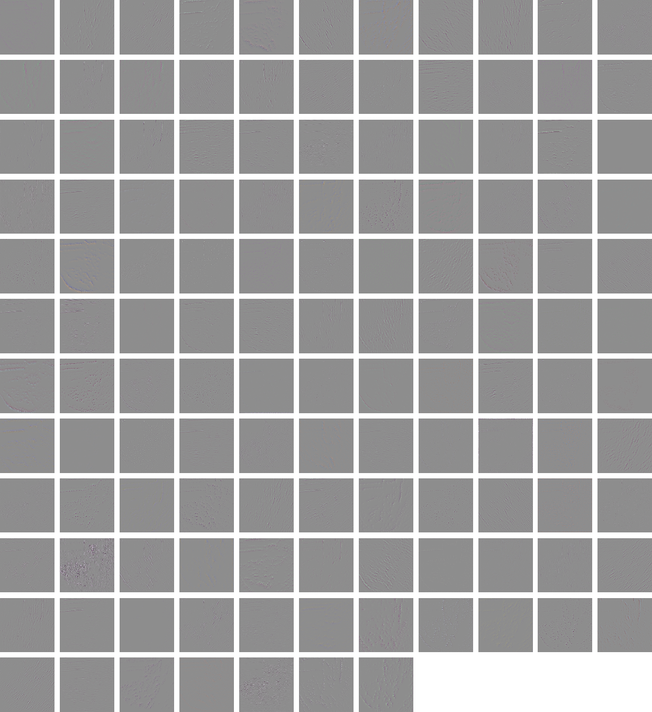
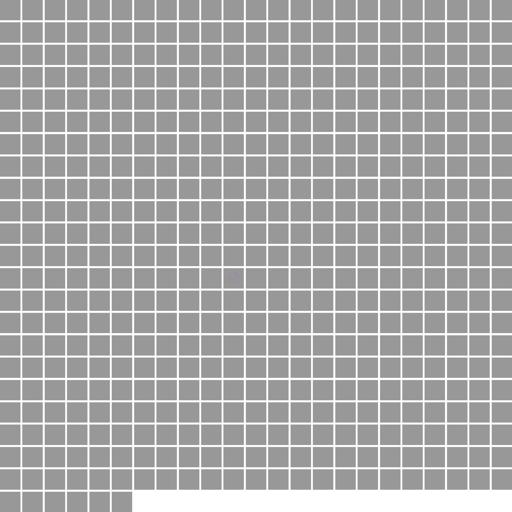

# CNN Activation Visualization

An implementation in Chainer of the neural network visualization by Zeiler and Fergus, [Visualizing and Understanding Convolutional Networks, 2013](https://arxiv.org/abs/1311.2901).

## Run

### Preparing a Trained Model
Download the pretrained VGG Chainer model following the README in [this](https://github.com/mitmul/chainer-imagenet-vgg) repository.

### Visualizing the Activations
Then, run the `visualize.py` script as follows. The VGG model will be feeded with an image and the activations in each of the five convolutional layer will be projected back to the input space, i.e. the space of the original image of size (3, 224, 224). The projections will be stored in the specified output directory.

```bash
python visualize.py --image-filename images/cat.jpg --model-filename VGG.model --out-dirname results --gpu 0
```

### Notes

You can visualize the activations for an image of arbitrary size since the image will be scaled to the size expected by the classifier automatically.

## Samples

Activations visualized from the convolutional layers of VGG using an image of a cat.

### 1st Layer of Convolutions



### 2nd Layer of Convolutions



### 3rd Layer of Convolutions


### 4th Layer of Convolutions


### 5th Layer of Convolutions


